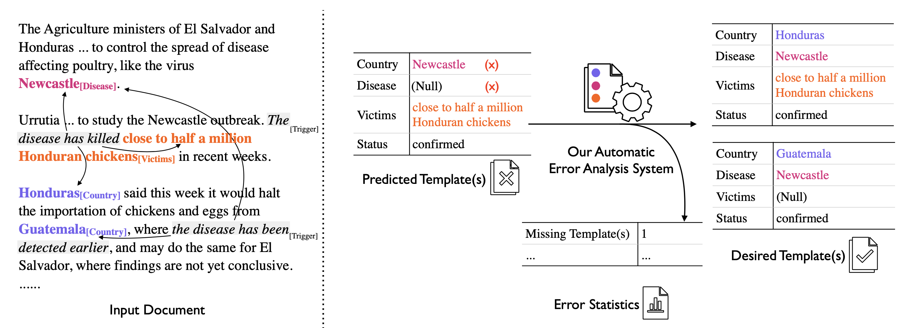

<h1>
<b>Automated Error Analysis for Document Level Information Extraction From Scientific Text</b>
</h1>

 

 
*Figure 1: The document-level extraction task (left) and the automatic error analysis process (right).*

<h3>
<b>Introduction</b>
</h3>

Recent works proposing modern NLP models for the document-level information extraction tasks (Du et al., 2021; Li et al., 2021; Jain et al., 2020) have their performance measured by different datasets via varying metrics, with limited, often manual analysis of model errors which are less informative (e.g., scores alone cannot detail model’s tendency to assign incorrect types to selected noun phrases, or frequency of spurious templates/clustering generation). There has not been a systematic investigation on models’ error profiles across domain-diverse document-level IE datasets.

In this work, we introduce several representative document-level IE datasets. Then, inspired by the work of Kummerfeld and Klein (2013) on tackling the error analysis challenge for coreference resolution, we introduce a framework for automating the process of error analysis for document-level information extraction tasks. This framework automatically transforms the predicted outputs into the desired extraction structures, through a set of transformations (Figure 1), and then maps each transformation or a set of transformations into sensible and linguistically motivated error types (Table 2). We apply two state-of-the-art neural methods to three document-level information extraction tasks from multiple domains including the scientific literature. One method (i.e., GTT (Du et al., 2021) is designed for doc-level extraction; the other is DyGIE++ (Wadden et al., 2019), sentence-level extraction augmented with clustering to create the doc-level representation. We also replace their base pre-trained model with SciBERT (Beltagy et al., 2019). We analyse their behaviors and errors in their predictions via our automatic framework.

<h3>
<b>Datasets</b>
</h3>

 
*Table 1: Dataset Statistics. A relevant document has one or more templates.*

Table 1 presents statistics for the three datasets that we conduct experiments and error analysis on. 
- MUC-4 (MUC-4, 1992) consists of news, each of which describes one or more terrorist incidents. The slots/roles that we chose to extract from the dataset were *Incident Type*, *Perpetrator (Individual)*, *Perpetrator (Organization)*, *(Physical) Target*, *Victim* and *Weapon*.
- ProMed (http://www.promedmail.org) consists of global disease outbreak reports. The slots/roles that we chose to extract from the dataset were *Status*, *Country*, *Disease*, and *Victims*.
- SciREX (Jain et al., 2020) is a recent dataset for scientific document-level IE, consisting of annotated articles on Machine Learning from Papers with Code, where we specifically focus on its 4-ary relation extraction sub-task. The slots/roles that we chose to extract are *Material*, *Method*, *Metric* and *Task*.

<h3>
<b>Evaluation</b>
</h3>

 
*Figure 2: F1 Evaluation Metric.*

We use F1 score from MUC-4 (Chinchor, 1992) which is shown above in Figure 2, where Precision is a measure of the fraction of predicted role fillers that are correct, while Recall is a measure of the fraction of expected role fillers that are correctly predicted. As the Precision and Recall vary by how each predicted template is individually unmatched or matched with one gold template, we enumerate F1 scores for all possible mappings and use the highest F1 score matching to serve as a guide to our transformation and error analysis process.

<h3>
<b>Methodology</b>
</h3>

Similar  to  the  work  of  Kummerfeld  and  Klein (2013), our error analysis tool is  system-agnostic, i.e. it only uses system output and does not consider intermediate system decisions. This is because we wanted a tool that would allow for error analysis and comparison across different kinds of systems - end to end or pipeline; neural or pattern-based, and there were no other methods that could be uniformly applied across all systems. Our tool is also  dataset-agnostic, simply requiring the names of the slots/roles to be specified in order to read data correctly from the input file and displaying per slot precision, recall and F1.

Given the input consisting of the predicted and gold templates for every document in the dataset, our error analysis tool performs the folowing steps:

1. Finds an optimized matching of the predicted templates to the gold templates per document, choosing the matching attains a higher total F1 score across all slots/roles.
2. Compares the matched pair of predicted and gold templates in a document, and applies transformations in order to convert the system predicted templates into the desired templates that would attain a 100% F1 score upon evaluation with respect to the gold templates. 
3. Maps the changes made in the conversion process to different error types.

<h3>
<b>Transformations</b>
</h3>

 
*Figure 3: Automated transformations convert predicted templates (on the left) to desired templates (on the right). Arrows represent transformations. Colored circles represent role-filler entity mentions.*
 

There are a fixed set of transformations involved in changing the predicted templates to the desired templates (with 100% F1) as detailed below:

 
 
*Figure 4: Formula for absolute SCS.*

 

 
*Figure 5: Formula for geometric mean SCS.*

  1. Alter Span transforms a role filler into a gold role filler which has the lowest span comparison score (<i>SCS</i>). *SCS* has the property that if the predicted role filler is an exact match for the gold role filler, the *SCS* is 0. If there is some overlap between the spans, the *SCS* is between 0 and 1 (not inclusive), and if there is no overlap between the spans, the *SCS* is 1. To calculate the span comparison score between two spans x and y, we use one of two scoring modes:
  - **absolute**:  As seen in Figure 4 above, this mode captures the (positive) distance between the starting indices (and ending indices) of spans x and y in the document, and scales that value by the sum of the lengths of x and y, capping it at a maximum of 1.
  - **geometric mean**: As seen in Figure 5 above, this mode captures the degree of disjointedness between spans x and y by dividing the length of the overlap between the two spans with respective to each of their lengths, multiplying those two fractions and subtracting the final result from 1. If *si* is the length of the intersection of spans x and y, and neither x nor y have length 0, *SCS* is calculated as shown below. Else, *SCS* is 1. 
  - Thus, if 
  2. Alter Role changes the role of a role filler to another role within the same template.
  3. Remove Duplicate Role Filler removes a role filler that is co-referent to an already matched role filler.
  4. Remove Cross Template Spurious Role Filler removes a role filler that would be correct if present in another template (in the same role).
  5. Remove Unrelated Spurious Role Filler removes a role filler that has not been mentioned in any of the gold templates for a given document.
  6. Introduce Missing Role Filler introduces a role filler that was not present in the predicted template but was required to be present in the matching gold template.
  7. Remove Spurious Template removes a predicted template that could not be matched to any gold template for a given document.
  8. Introduce Missing Template introduces a template that can be matched to an unmatched gold template for a given document.

<h3>
<b>Error Type Mappings</b>
</h3>

 
*Table 2: Examples of the Error Types from the MUC-4 dataset. For each template, in every role, the role fillers within brackets refer to the same entity, while role fillers in different brackets refer to different entities. The text in bold black indicates the error in the prediction. T1 and T2 refer to Template 1 and Template 2 respectively.*

The  transformations in the Transformations Section are mapped onto thirteen error types. In some cases, a single transformation maps onto a single error, while in others a single error is mapped to a specific list of transformations applied in the error correction process.

1. Span Error. Each singleton Alter Span transformation is mapped to a Span Error. A Span Error occurs when a predicted role filler becomes an exact match to the a gold role filer only upon span alteration.
2. Duplicate Role Filler. Each singleton Remove Duplicate Role Filler transformation is mapped to a Duplicate Role Filler error. A Duplicate Role Filler error occurs when a spurious role filler is co-referent to an already matched role filler and is treated as a separate entity.  This happens when the system fails at co-reference resolution.
3. Duplicate Partially Matched Role Filler. Same as 2. above, but with an added Alter Span transformation applied first to account for partial matching.
4. (Within Template) Incorrect Role. Each singleton Alter Role transformation is mapped to a (Within Template) Incorrect Role. A (Within Template) Incorrect Role error occurs when a spurious role filler is assigned to the incorrect role within the same template, i.e. the role filler would have been correct if present in another slot/role in the same template. This happens when the system fails at correct role assignment.
5. (Within Template) Incorrect Role + Partially Matched Filler. Same as 4. above, but with an added Alter Span transformation applied first to account for partial matching.
6. Wrong Template for Role Filler. Each singleton Remove Cross Template Spurious Role Filler transformation is mapped to a Wrong Template for Role Filler error. A Wrong Template for Role Filler error occurs when a spurious role filler in one template can be assigned to the correct role in another template, i.e., it would be correct if it had been placed in another template in the same role. This happens when the system fails at correct event assignment.
7. Wrong Template for Partially Matched Role Filler. Same as 6. above, but with an added Alter Span transformation applied first to account for partial matching.
8. Wrong Template + Wrong Role. An Alter Role and a Remove Cross Template Spurious Role Filler transformation are applied to the same predicted role filler in that order to be mapped to a Wrong Template + Wrong Role error.  A Wrong Template + Wrong Role error occurs when a spurious role filler can be assigned to another role in another template. This happens when the system fails at correct role assignment and event assignment.
9. Wrong Template + Wrong Role + Partially Matched Filler. Same as 8. above, but with an added Alter Span transformation applied first to account for partial matching.
10. Spurious Role Filler. Each singleton Remove Unrelated Spurious Role Filler transformation is mapped to a Spurious Role Filler error.  A Spurious Role Filler error occurs when a mention is extracted from the text with no connection to the gold templates.
11. Missing Role Filler. Each singleton Introduce Missing Role Filler transformation is mapped to a Missing Role Filler error. A Missing Role Filler error occurs when a role filler is present in the gold template but not the predicted template for a given role.
12. Spurious Template. Each singleton Remove Spurious Template is mapped to a Spurious Template error. A Spurious Template error occurs when an extra predicted template is present that cannot be matched to a gold template.
13. Missing Template. Each singleton Introduce Missing Template transformation is mapped to a Missing Template error. A Missing Template error occurs when there is a gold template remaining that has no matching predicted template.
  
<h3>
<b>Results and Analysis</b>
</h3>
